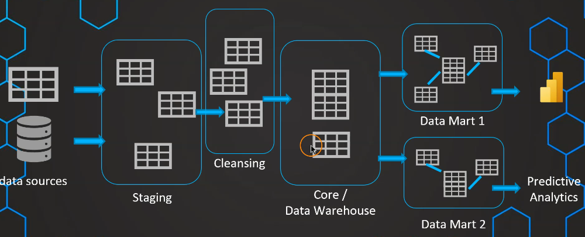
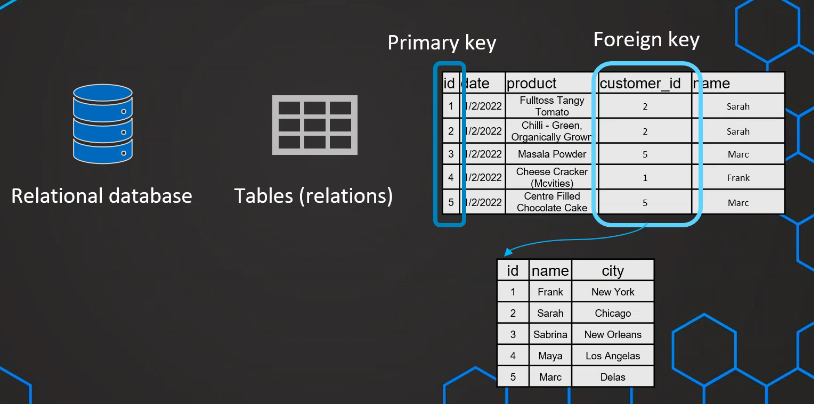
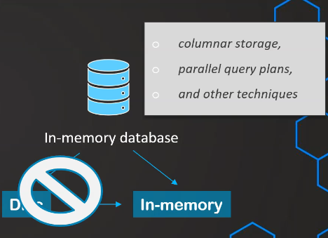
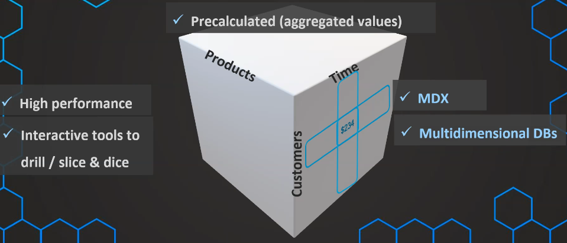

# 1. Layers of a DW

- Staging area: 

    - very quick
    - keep data as raw as possible
    - conform *loosely* with organization's schema

- Cleansing area (optional, when data is too dirty):
    - Another layer specified to clean data

- Core area (some might say DW itself):
    - combine different data table to one
    - conform **strictly** with organization's schema

- Data marts (optional, when we have multiple use cases):
    - Comply to use cases need
    - Basically a subset of original DW
    - Dimensional-augmented

# 2. Relational Databases

Hmm, how to say this, you should already know about this

Just be aware that RDBMS can be used as Data Warehouses

# 3. In-Memory databases

## a. What are their capacities:

- Highly optimized for query performance
- Good for OLAP
- Usually used for data marts
- Can be relational, or not

## b. How are they techinically implemented:

- Straight to memory
- Use columnar storage, parallel query plans...
- Use snapshots, images of data to negate the drawbacks of in-memory technology

    

# 4. Cubes

## a. Overview

- DW based on RDBMS (ROLAP)
- DW based on Cube (MOLAP: Multidimension OLAP)
- Use arrays instead of tables
- Fast query
- Work well with BI applications

    

## b. Take outs:

- Good with low amount of dimensions (data marts)
- Good for interactive queries with hierarchies
- Not so relevant today since:
    - Advancement of hardware
    - Alternatives: tabular models, ROLAP, columnar storage...