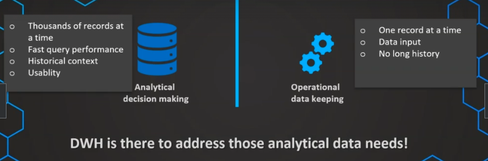
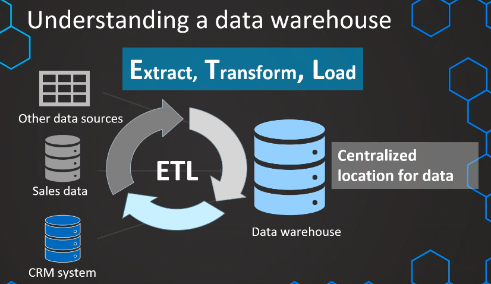
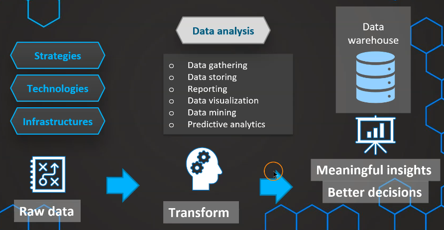

# 1. Why data warehouse?

## a. How is data used in a company and requirements

- Transactional (OLTP):
    - Receive orders
    - React to complaints
    - Fill up stock

    **&rarr; Turn the wheel**
    
    - Requirements:

        - 1 record at a time
        - Data input
        - No long history

- Analytical (OLAP):
    - What's the best category?
    - How many sales comapred to last month?
    - What can be improved?

    **&rarr; Watch how the wheel turn**

    - Requirements:
    
        - Thousands of records at a time
        - Fast query performance
        - Historical context
        - Usability

## b. Common statements

- Yes, we have a lot of data but we don't use it
- Our data is very complicated and difficult to analyze
- It's spread all over different systems and difficult to access
- I just want to see what is relevant
- We need to access data quick and easily
- We want to make fact-based decisions

## c. Why DW?

For OLAP requirements, that's it

# 2. What is a Data Warehouse?

A database used and optimized for OLAP

- Centralized and consistent location for data
- Consistent and repeated loading process
- User friendly (not as technical)
- Fast query performance
- Reporting and data visualization built on top

# 3. What is Business Intelligence?

Data &rarr; Reports, visualizations, predictions

# 4. Data Lake or Data Warehouse?

Depending on the use case, we can use both, one or none and just switch to Lakehouse for ACID in Data Lake

| Categories | Lake | Warehouse |
| -- | -- | -- |
| Data | Raw | Processed |
| Techonologies | Big data | Database |
| Structure | Unstructured | Structured |
| Usage | Not defined | Specific & ready to use |
| Users | DS | BI & IT |
