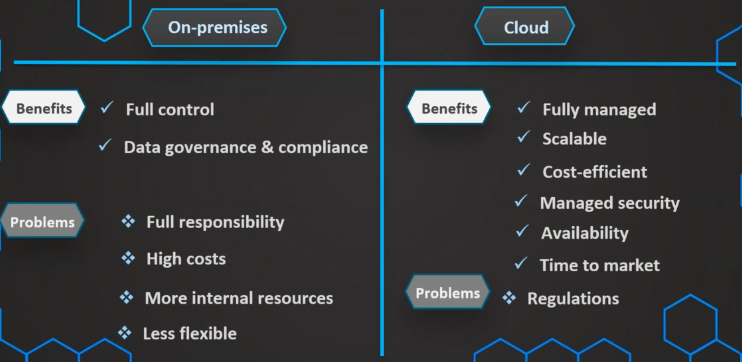
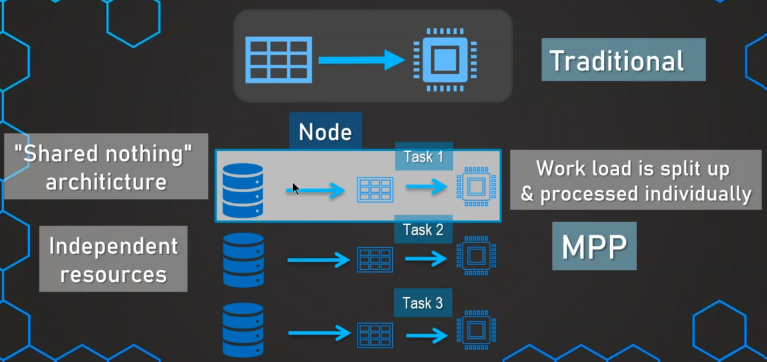
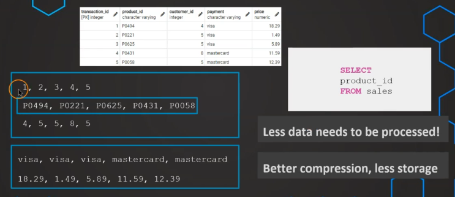

# 1. Common use cases

- Basis for reporting
    
    - Performance
    - Integrated
    - Strategic decisions
- Enable business users to analyze data

    - Easy to use
    - Data quality
    - Accessible
- Predictive analytics

    - Continous Training of ML models
- Use big data (IoT and such)

    - Aggregate
    - Filter

# 2. Optimizing DW
## Indexing
- Helps to make data reads faster
- Slower data writes
- Additional storage
- Types:

    - B-tree (standard):

        - Multi-level tree structure
        - Break data down into pages or blocks
        - For **high-cardinality** columns

        
    - Bitmap

        - Large amounts of data + *low-cardinality*
        - Storage efficient
        - Mor optimized for read & few DML-operations

        

### Indexing Guide

1. Should we put index on every column?

    - No! Storage + Create/Update time
    - Use to avoid full table reads, frequently

2. For fact tables

    - B-Tree on surrogatee key
    - Bitmap on foreign keys

3. For Dimension tables

    - Is the table big?
    - Are they frequently used?
    - B-tree or Bitmap based on carinality

# 3. The modern DW
## a. Cloud vs. On-premises

## b. Massive parallel processing (MPP)

- Solve performance issues
- Many people can run queries at the esame time with good performance
- Centralizing massive amount of data
- i.e. Snowflake

## c. Columnar Storage

- Table with 100 columns
- Only 5 are needed for analytics
- Traditional DB: scan all rows for those columns
- Columnar Strorage: only get the columns, much like hash map

