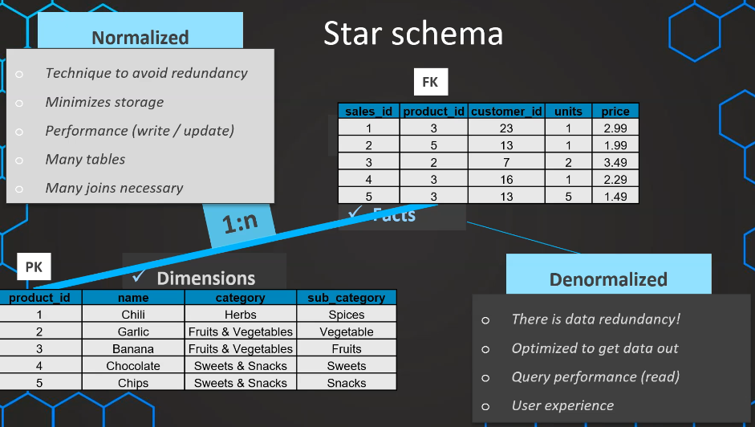
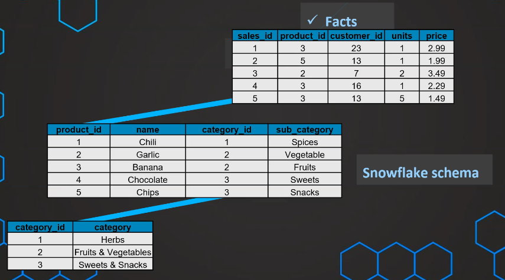

# 1. What is Dimensional Modeling?

A method of organizing data in a DW:

- Facts: measurements (profit, spendings, date,...)
- Dimensions: context (filter, groups...) for measurements
- Benefits:
    - Faster data retrieval
    - Usability/OLAP/Reporting oriented

# 2. Star Schema

- A **Fact** and its *Dimensions* form a 1:n relationship
- 1 layer of dimension &rarr; *Redundancy*
- Good Query Performance and User Experience

# 3. Snowflake Schema

- A more normalized version of Star Schema
- Less space used due to normalization
- Write faster, read slower

