# 1. Dimension Tables

- Natural and Surrogate keys:

    - Should use Surrogate keys
    - Not necessary but can keep Natural key for reference
    
- How can a fact table refer to a dimension with new surrogate key, without natural key? Look up table:

    1. Create a table of natural keys only
    2. Create a new column on that table, with surrogate key populated

        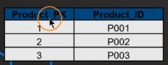

**&rarr; Lots of columns, with descriptive attributes, few rows**

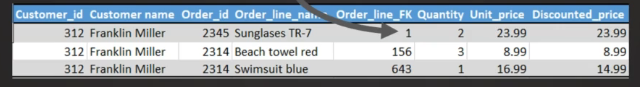

*Notes: Group and Filter can be called Slice and Dice*

# 2. Date Dimension

- One of the most important dimensions
- Has meaningful surrogate key (**YYYYMMDD**)

    e.g. 20-10-2020 &rarr; 20201020

- In case the data for date are not filled, result in **NULL value in the date foreign key**, an additional row in the date dimension can be created as a dummy value

    e.g. NULL &harr; 19000101

- Can be populated in advance, 5 to 10 years for example

- Date features:
    
    - Number and Text (e.g. January 1)
    - Long and Abbreviated (e.g. Jan or January)
    - Combination of attributes (e.g. Q3 or 2024-Q3)
    - Fiscal dates
    - Flags (e.g. holidays, weekends...)

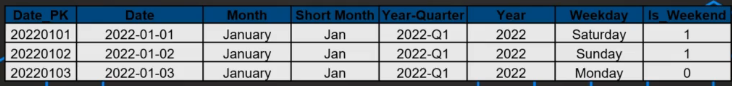

# 3. NULL in Dimensions

- Must be avoided in Foreign Keys
- Add a dummy value for NULLs:
    
    - Make the value descriptive
    - More options for aggregations

    

# 4. Hierarchies in Dimensions

- Don't normalize
- Denormalize for better read performance
- In case the users ask for more readable data, can add another column with combined data for cohesiveness

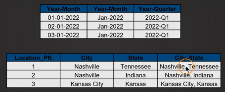

# 5. Conformed Dimensions

An interesting concept: 1 dimension that contributes to 2 or more facts, *different granuality works too*.

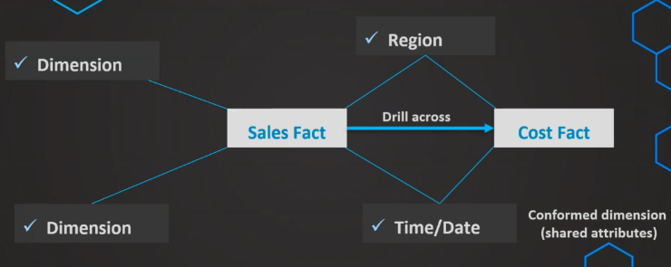

Drill across: create a fact upon a conformed dimension to compare 2 or more facts

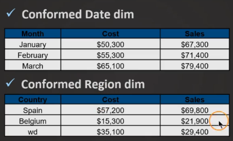

# 6. Degnerate Dimensions

Dimensions that contribute to grouping and filtering of a fact, but the only attribute needed is the ID (Foreign Key)

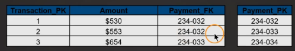

Often indicated as _DD in the fact table

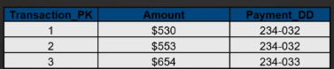

Some examples: invoice no., billing no. and order id

# 7. Junk Dimensions

Some fact tables have a lot of attributes that are of multiple choice (flags, indicators):

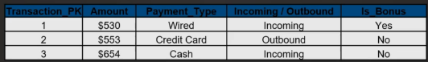

- Eliminate if not relevant 
- If relevant, leave them as they are in the fact
- If too bulky, make fact table big, put them in a flag dimension
- Also called *junk dimension*, or a better term for business users ***transactional indicator dimension***

How to make a junk dimension?

- Grab the attributes
- List all combinations of the attributes
- There you go

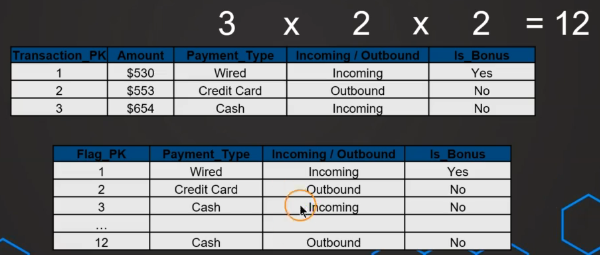

What if too many combinations?

- Extract only relevant attributes
- It's legal to make more junk dimensions

# 8. Role-playing Dimensions

This one is kinda meh, a fact table referencing the same dimension table more than once

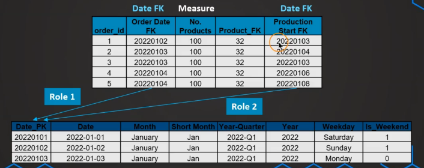