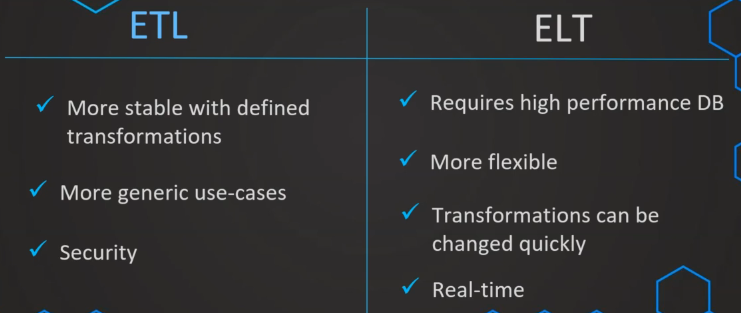

# 1. What is an ETL Process?

- How to design dimensional model
- How to bring data from source to DWH

# 2. ETL Tools

- Connect to different data sources
- Transform / Clean data
- Load data
- Set-ups:

    - Building workflows:

        - Staging
        - Core / Transformation
        - Data Mart

    - Jobs:

        - Run the workflows
        - Are scheduled based on defined rules

- Types:

    - Enterprise

        - Commercial
        - Mature ✅
        - GUI ✅
        - Architectural needs ✅
        - Support ✅
    - Open-source

        - Source code
        - Often free ✅
        - GUI ✅
        - Support ❓
        - Ease of use ❓
    - Cloud-native

        - Cloud tech
        - Data in cloud already ❓
        - Efficiency ✅
        - Flexibility ❓
    - Custom

        - Own development
        - Customized
        - Internal resources
        - Maintainance ❓
        - Training ❓

    

- Choosing an ETL Tool
    
    - Evaluate current situation/needs
        
        - What you want to improve?
        - Data sources & other tools?
        - Define the **requirements**
        - Define responsibilities
        - Who are the users?
- Evaluate tools

    

- Test / Demo / Trial

# 3. ETL Process
## a. Extract
- Data will be put into a staging layer
- From there, data will be transformed later
- This layer is *transient* (most of the time), else **permanent**
- Transient: all data is copied then deleted

    

- Types of extraction:

    - Initial load:

        - First run
        - All data
        - After discussion with the business users + IT:

            - What data is needed?
            - When is a good time to load the data?
            - Smaller extractions to test.

    - Delta load:

        - Subsequent runs
        - Only additional data
        - Delta column for every table:

            - Transaction_date, create_date, etc
            - Incrementing number (Suitable primary key), remember the `MAX(increment_key)` for next load

                

        - What if no delta column?

            - Tools can capture automatically through metadata
            - Full load everytime and compare the data that is already loaded
            - Data volumes &rarr; performance

        - When loading into DWH after staging layer:

            - Insert: simple
            - Update: follow SCD Types
            - Delete:

                - We don't usually do that
                - Add another column suggesting that the item is removed in the data source

                    

## b. Transform
- Goals:

    - Consolidate from multiple systems

        

    - Reshape data according to business requirements

        

- Basic:

    - Deduplication
    - Filtering rows
    - Cleaning and Mapping

        

    - Value standardization
    - Surrogate key generation

- Advanced:

    - Joining
    - Splitting: location &rarr; city, state, zip
    - Aggregations
    - Deriving Values: tax percent &rarr; tax amount

## c. Scheduling jobs
- What are the requirements?
- How long does it take?
- When is a good time?

    - Effect on productive system
    - Short read access
    - Night? Morning?

# 4. ELT Process

- Strong target database for transform step
- Flexible, close to real-time extract-load process

    

# 5. ETL vs ELT

