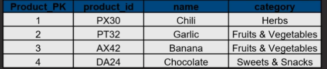

# 1. Types of facts

- Additive: 
    - Can be added across **all** dimensions
    - Most facts are fully additive

        &rarr; Flexible and useful

- Semi-additive: 
    - **few** dimensions
    - Averaging can be an alternative

        &rarr; Used carefully and less flexible

- Non-additive:
    - Can't be added
    - Limited analytical value

        &rarr; Store underlying value
    - E.g. Ratio, percentage...

# 2. Nulls in facts

- Not likely a problem if the facts have nulls
- The problem arises when a foreign key has nulls
- Solution: add a dummy value for null keys for data connectivity (in the image below, it's 999)

# 3. Types of fact tables

| Type | Transactional | Periodic snapshot | Accumulating snapshot |
| -- | -- | -- | -- |
| Grain (1 row) | 1 transaction | 1 defined period | 1 lifetime of process |
| Date Dimensions | 1 trans date | Snapshot date (end of period) | Multiple snapshot dates |
| No. of dimensions | High | Lower | Can be very high |
| Facts | Measures of trans | Cumulative measures of trans | Measures of process in lifespan |
| Size | Largest (most detailed grain) | Mid (less detailed grain) | Lowest (highest aggregation) |
| Performance | Can be improved with aggregation | Better | Good performance |

## a. Transactional fact table

- Most common and very flexible
- Typically additive
- A lot of dimensions
- **BEEG** in size

## b. Periodic snapshot fact table

- No events &rarr; NULL or 0 in facts (NULL if we don't want to count within the average)
- Typically additive
- Lots of facts and fewer dimensions
- Not so **BEEG**

## c. Accumulating snapshot fact table

- Least common
- Workflow or process analysis
- Multiple Date/Time foreign keys (for each process step)
- Date/Time key associated with *role-playing dimension*

## d. Factless fact table

- Factless is the state of a fact (data), not the state of the table itself. The table has facts that are factless **(no numeric metrics)**
- Very niche, logging purpose might be the only use case
- Mostly consist of dimension PKs

# 4. Steps to create a fact table

1. Identify business process for analysis

    Ex. sales, order processing...

2. Declare the grain (detail-ness of database)

    Ex. transaction, order, order lines, daily, daily + location...

3. Identify dimensions that are relevant

    Ask What, When, Where, How and Why
    
    **&rarr; Filtering & Grouping**

4. Identify facts for measurement

    *These are defined by grain, not be specific use-case*

# 5. Natural and Surrogate Key

## a. What are they?

- Natural key: key from the source system
- Surrogate key:

    - key from the ETL, database tool
    - Usually integer
    - With _PK or _FK suffix

## b. Why Surrogate key?

- Improve performance (less storage / better joins)
- Handle dummy values (nulls / missing values) using 999 or -1
- Integrate multiple source systems
- Easier administrate / update
- No natural key originally???

## c. Practical guide to Surrogate key

- Create them, use them, don't leave them
- Implement for all kinds of tables, except maybe `date` dimension
- Keep the natural keys around, might need them