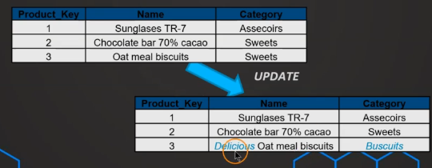
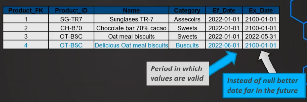
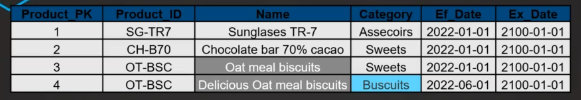
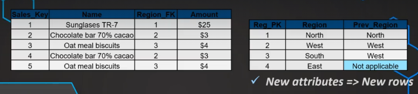

# Slowly Changing SCD

Dimensions might change a lot in real-world application. How should we address that?

- Be proactive: ask about potential changes
- Business users + IT
- Strategy for each changing attribute

# 1. Type 0: Retain Original

- There won't be any changes
- Date Table
- Truly **Original**
- Very simple and easy to maintain

# 2. Type 1: Overwrite

- Old attributes are overwritten
- Only current state is reflected
- Very simple
- No Fact table needs to be modified
- *History is lost!*
- *Might affect / break existing queries*

# 3. Type 2: New Row

- Implementation:

    - Add row in the Dimension with same Natural key
    - Add 2 date columns: Effective and Expired (`Ef_Date` and `Ex_Date`)
    
        &rarr; Good for ELT to use the correct Foreign key

    - Can also have `Is_Current` column for better intuition for business users

- Changes are reflected with history &rarr;
- No updates in Fact table
- Just add the new foreign key to Fact table

# 4. Mixing Type 1 and Type 2

- Some attributes can be Type 1 and some Type 2
- No "set in the stone rules", not a technical decision
- Need to be defined with business users

# 5. Type 3: Additional Attributes

- Add a column
- Switch between versions
- Typically used for significant changes at a time (i.e. restructuring in org)
- It's *possible*, not **recommended** to have too many columns
- Limitations: very specific use case

    - Not suitable for frequent or unpredictable changes &rarr; Type 2
    - Minor changes &rarr; Type 1

